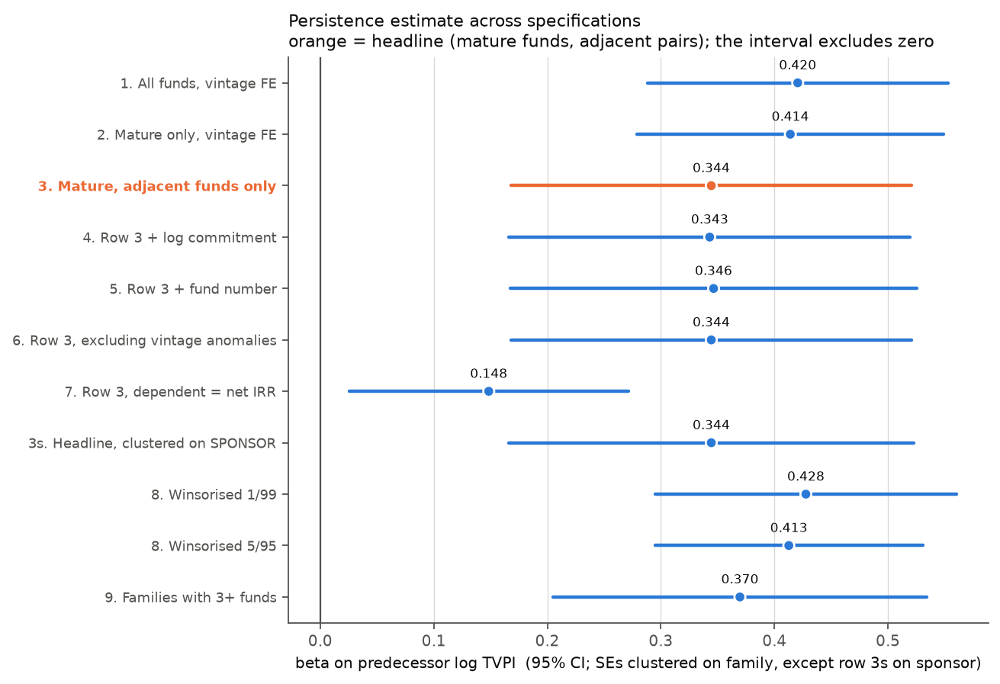

# Do good private equity funds stay good?

A private equity firm raises a fund. It spends about ten years buying
companies, improving them, and selling them. Then it raises another fund and
does it again.

This project asks one question. If a firm's last fund did well, does its next
fund do well too?

The question matters because pension funds and university endowments decide
where to put money largely on this basis. They back firms whose previous funds
performed. If past performance predicts future performance, that is sensible.
If it does not, a lot of money is being allocated on a pattern that is not
there.

I answer the question with data that US public pension plans are required by
law to publish. The short answer is yes, it does predict, by about a third.
The estimate is in `RESULTS.md`. The code is in this repository and runs end to
end.

## What I found

I regress each fund's return on the return of the firm's previous fund. The
coefficient on the previous fund is the answer. Call it beta. A beta of 1 means
performance carries over completely. A beta of 0 means the previous fund tells
you nothing.



Beta is 0.344. The 95% confidence interval runs from 0.168 to 0.521. It does
not contain 0. A firm whose last fund beat its peers by 10% tends to beat them
by about 3.4% with the next one.

That estimate uses 220 pairs of funds drawn from 116 fund families.

A fund family is one firm's numbered series. Blackstone Capital Partners V
through IX is a family. Blackstone Tactical Opportunities is a different
family, run by a different team with a different mandate, even though the same
firm owns both. I measure persistence inside a family. Pooling everything a
firm manages would credit a buyout team with a credit team's results.

**The more interesting result is how I got here.** An earlier version of this
study used one pension plan. It had 65 pairs from 39 families, estimated beta
at 0.214, and could not rule out zero. It also worked out, at the time, that a
study with 39 families could only detect a beta of 0.435 or larger, and had
about a 19% chance of detecting the 0.214 it was estimating. So the null result
was close to guaranteed before the data was ever looked at, and the write-up
said so.

That was a prediction, and it was testable. I added a second pension plan.
116 families instead of 39. The smallest detectable beta fell to 0.283. The
same code, on the same specification, now finds 0.344 and rejects zero. The
point estimate moved by less than one standard error.

**So the first study's null was a statement about its sample size, exactly as
it claimed to be.** That is worth more than either number on its own.

### Is that just a different set of funds?

It could have been. The second plan holds older funds that have actually sold
what they bought, and the research literature reports stronger persistence
among older funds. If so, the pooled number would be an average of two
different things and quoting it as one number would hide the real result.

It isn't. Estimated separately, the first plan gives 0.214 and the second gives
0.358. They differ by about one standard error, which is to say they agree.
What separates them is the width of the error bars, not the answer. 39 families
cannot exclude zero at a beta of 0.3. 90 families can.

Running the new pipeline on only the old plan's data returns 0.2142 with 65
pairs and 39 families, matching the earlier study to four decimal places. That
is the check that nothing else changed underneath.

### Why two plans and not one bigger one

There is no bigger one. Each US public pension plan publishes only the funds it
personally invested in. The two here are very different tables:

| | funds | oldest fund | funds started before 2000 | typical fund started |
|---|---|---|---|---|
| CalPERS | 462 | 1998 | 1 | 2021 |
| Oregon PERS | 447 | 1981 | 68 | 2011 |

CalPERS deletes a fund from its table once the fund finishes and pays out
everything. So its old funds are only the ones still limping along twenty years
later, which is not a random reason to still exist. Oregon keeps everything.
Almost every fund in this study old enough to have finished comes from Oregon.

A fund both plans hold is counted once, not twice. I match those on the family
name plus the fund's number in the series, and keep the CalPERS figures. That
rule barely matters — where both plans report the same fund they agree to
within 0.82% — but it is written down so the answer cannot depend on which
file I happened to load first.

## What you need

Python 3.11 or newer. Nothing else is required to reproduce the results.

Install the packages:

```
pip install -r requirements.txt
```

The data is already in this repository. You do not need to download anything.

CalPERS publishes one HTML table covering 462 funds, and only for the current
quarter. Oregon PERS publishes a PDF each quarter and leaves old quarters
online. I have 18 of those, covering March 2021 to March 2026 and 447 funds in
the most recent one. Both feed the estimate.

I commit the Oregon files rather than downloading them at run time. Oregon
removes old quarters from its website. A file that disappears cannot be
fetched again. Committing them also means the numbers here do not change under
you.

Getting those files was harder than it should have been. Oregon has used five
different naming schemes for the same quarterly report, and files at least one
report in the folder for the wrong year. Guessing URLs from the current scheme
found 8 reports. Reading the links off the Treasury holdings page found 18. The
fetcher reads the page.

## How to run it

```
python -m pytest -q
./run_all.sh --offline
```

The test suite has 232 tests. On a fresh clone 8 of them skip, because they
check tables that the pipeline has not written yet. Run the pipeline and they
pass.

`--offline` uses the committed data and needs no network. Drop the flag to
re-download both plans. Do that only if you want fresher data, and expect the
numbers to move, because Oregon's archive will have shifted.

The whole run takes a few minutes. Most of that is two simulation studies:
the power calculation and a check on vintage-year errors.

## What you get

Tables in `data/`, as CSV. The specification table, the mapping robustness
table, the sample splits, the transition test, the power curve, and the
cross-plan comparison.

Figures in `figures/`. Six of them, including the one above.

The write-up in `RESULTS.md`. That is the paper-shaped version: what is
estimated, the table, the inference, the limitations.

A record of the work in `DEVELOPMENT_LOG.md`. Design decisions, and the things
that turned out to be wrong.

The code:

```
src/pefund/metrics.py       TVPI, IRR, Kaplan-Schoar PME, Direct Alpha
src/pefund/persistence.py   the estimator and every test around it
src/pefund/ingest/          one adapter per data source, plus shared cleaning
analysis/                   one script per output
```

## How much you can trust it

I checked the estimate six ways. None of them overturned it.

**The estimator recovers a known answer.** I simulate fund histories with a
persistence I choose myself, then run the real estimation code on them. Across
six settings with true betas from 0.00 to 0.44, every confidence interval
covers the truth.

**Standard errors use a wild cluster bootstrap.** Funds from the same firm are
not independent observations. The usual fix is clustering, which widens the
error bars to account for that. Clustering relies on having many groups. I now
have 116, which is comfortable, but I kept the bootstrap because it was needed
at 39 and because group sizes here are lopsided. To check the concern was real
I generated data with no persistence at all and counted how often each method
wrongly found some. At 20 groups the standard method reported a false positive
9 to 13 times in 100, against the 5 it should. The bootstrap reported 4 to 6.

The bootstrap works by imposing the answer of zero on the data, then flipping
the sign of each firm's residuals at random, thousands of times, to see how
large a coefficient turns up by chance. Every p-value in the table is computed
this way. Every one is larger than the standard method's — the standard method
manufactures persistence rather than hiding it. At this sample size that no
longer changes any conclusion: the headline is 0.0001 by the standard method
and 0.0039 by the bootstrap, and both reject.

**Fund-name matching does not drive the result.** The largest manual step in
this project is deciding which funds belong to the same family. Names are
inconsistent. "Advent International GPE V-D" and "Advent International GPE
VI-A" are the same series, but a share-class letter on the end stops any simple
rule from seeing it. Worse, the two plans spell the same fund differently:
Oregon writes "Mayfield XVII" where CalPERS writes "Mayfield XVII, a Delaware
Limited Partnership", and one fund becomes two. I hand-checked and recorded 99
merge decisions and 70 deliberate refusals to merge, each with a reason.
Running the estimate with no merges, with only the certain merges, and with all
of them gives betas of 0.368, 0.353 and 0.344. The spread is a quarter of one
standard error.

**No single firm or year carries it.** Dropping each family in turn and
refitting gives betas between 0.309 and 0.438 across 116 refits. Dropping each
year gives 0.319 to 0.432 across 29. None comes close to zero.

**It is not an artefact of the functional form.** Ranking funds within their
year and correlating the ranks gives 0.381, with a permutation p-value of
0.0001. Same sign, same rough size, same conclusion, and it does not assume the
relationship is a straight line.

**The quartile table says the same thing without any model.** Sort funds into
four buckets by how they did against funds started the same year, then ask
where the next fund lands. A bottom-quartile fund is followed by another
bottom-quartile fund 45% of the time, against 25% if it were random. A
top-quartile fund is followed by another top-quartile fund 47% of the time. Over
205 pairs the odds of that pattern arising by chance are 1 in 10,000.

**Reporting error is small.** 43 funds appear in both plans on the same
reporting date. That is two independent readings of the same fund. Seven of
them are funds Oregon sold on the secondary market, where the reported figure
is a sale price rather than a valuation, so I exclude them. On the remaining
36, the median disagreement between the two plans is 0.82%. Correcting the
estimate for that much noise moves beta by less than a hundredth.

### A reasoning error that the simulation caught

I expected mislabelled vintage years to inflate beta. The vintage year is the
year a fund started investing, and I control for it, because funds that started
in 2006 all faced the same market. The two plans disagree about the vintage
year for 14 of the 36 shared funds. CalPERS is always the later of the two,
never earlier.

My argument was this. A fund assigned to the wrong year keeps some of its own
year's market movement in the residual. A firm's consecutive funds sit in
nearby years, so those leftovers are correlated across the pair. Correlated
leftovers are exactly what beta picks up. Therefore mislabelling inflates beta,
and the estimate is an upper bound.

I simulated it before writing it down. The simulation gave the opposite sign.
Displacing the labels by the pattern I actually observe moves beta from 0.264
to 0.226 at a true beta of 0.25, and from 0.511 to 0.441 at 0.50. The bias is
about -14%, and it is 0 when the true beta is 0.

The argument was wrong because it followed the residual and forgot the
regressor. The same unabsorbed market movement lands in the previous fund's
return as well, and noise in a regressor pulls a coefficient toward 0. That
effect is the larger of the two. It is also the same mechanism this project
already documented for leaving vintage controls out entirely, which I had not
connected.

So beta is a lower bound with respect to this error, not an upper bound. There
are five tests pinning the direction so the write-up cannot drift back to my
first instinct.

## Limitations

**The sample is still small in absolute terms.** 220 pairs, 116 families. Big
enough to detect a beta of 0.283 four times in five, which is why the result
exists. Not big enough to settle the low end: at a true beta of 0.1 this study
would find it 13 times in 100. So nothing here rules out that persistence is
small — it only rules out that it is zero.

**Funds that have wound up are missing from one plan.** CalPERS removes a fund
once it finishes. So a CalPERS fund from 2005 shows up only if it is still
holding something twenty years on, which is not a random reason to still be
around. Oregon does not do this, which is the main reason it is in the study.
68 of the 69 funds here started before 2000 come from Oregon. The problem is
much reduced, not gone.

**The two plans decide "too young to judge" differently.** Both mark funds
whose returns are not yet meaningful, and I drop those. CalPERS marks 43% of
its funds that way; Oregon marks 5%. So the filter is stricter on one half of
the data than the other. Running with no filter at all gives 0.384, above the
headline, so the filter is not creating the result.

**Most funds are too young to have sold much.** Their reported returns are the
manager's own valuation of companies it still owns, not cash returned. Those
valuations are smoothed and out of date. That cuts both ways here: smoothing is
noise, which pulls beta toward 0, but a manager who values the new fund with
one eye on the old one would push it up. The cross-plan comparison measures
only the part of that error where the two plans differ. Both get their numbers
from the same manager, so the shared part cancels and stays invisible.

**The vintage year itself is measured with error.** The two plans disagree for
14 of 36 shared funds. Vintage is the main control in every specification. The
simulation above says this pushes beta down, not up.

**Only funds these two plans chose to buy are in the data.** Both are large,
sophisticated investors. The sample is conditioned on a fund having looked
attractive to them beforehand. Nothing in public data fixes this.

**Neither plan publishes what strategy a fund follows.** So I cannot separate
buyouts from venture capital or credit. I considered guessing from fund names
and did not, because "Ares Corporate Opportunities" and "GSO Energy Partners"
are credit funds whose names do not say so. The Washington State Investment
Board does publish a strategy field, and is the obvious next source.

**PME is mostly not computable here, by design.** PME compares a fund against
what the money would have earned in the stock market. It needs dated cash
flows. Both plans publish running totals instead. I recover flows by
differencing consecutive snapshots, which only works for funds that had drawn
nothing when my archive starts. That is 63 funds out of 490. Their median PME
is 0.957, but 59 of the 63 still hold about 99% of their value as unsold
companies. That number describes managers' valuations against the market, not
realised returns, and I would not quote it as anything else.

## Sources

The data comes from two public disclosures:

- CalPERS Private Equity Program Fund Performance.
- Oregon PERS OPERF Private Equity Portfolio, quarterly.

The benchmark for PME is the market factor from the Kenneth French data
library. It is a total return, which includes dividends. A price index such as
the headline S&P 500 leaves dividends out, worth about two percentage points a
year, which compounds to roughly 22% of the benchmark over a ten-year fund
life. Using one would make every PME look better than it is.

The Oregon report carries a warning from the plan itself. It says its IRRs
"SHOULD NOT be used to assess the investment success of a partnership or to
compare returns across partnerships" and "HAVE NOT been approved by the
individual general partners". That is the disclosing institution describing the
measurement problem in its own words, and it is quoted in the code that parses
the file.

The files under `data/snapshots/` are public records. They are reproduced here
so the analysis still runs after the plans remove them. They are not covered by
this repository's MIT license.

Papers this project leans on:

- Kaplan, S. and Schoar, A. 2005. "Private Equity Performance: Returns,
  Persistence, and Capital Flows." *Journal of Finance* 60 (4).
- Harris, R., Jenkinson, T. and Kaplan, S. 2014. "Private Equity Performance:
  What Do We Know?" *Journal of Finance* 69 (5).
- Braun, R., Jenkinson, T. and Stoff, I. 2017. "How Persistent is Private
  Equity Performance?" *Journal of Financial Economics* 123 (2).
- Korteweg, A. and Nagel, S. 2016. "Risk-Adjusting the Returns to Venture
  Capital." *Journal of Finance* 71 (3).
- Cameron, A.C., Gelbach, J. and Miller, D. 2008. "Bootstrap-Based Improvements
  for Inference with Clustered Errors." *Review of Economics and Statistics*
  90 (3).
- Gredil, O., Griffiths, B. and Stucke, R. 2014. "Benchmarking Private Equity:
  The Direct Alpha Method."
- Takahashi, D. and Alexander, S. 2002. "Illiquid Alternative Asset Fund
  Modeling." *Journal of Portfolio Management* 28 (2).
