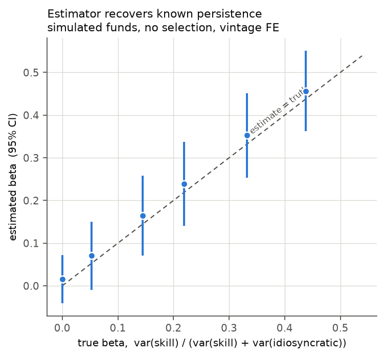

# Private equity fund performance: measurement and persistence

Estimating whether private equity general partners show persistent skill, and
measuring how far the answer moves when you fix the sample problems the data
usually hides.

This is deliberately not a dashboard. The deliverable is an estimate with a
standard error and an argument about what it identifies.

---

## What this project shows — the ninety-second version

**The question.** Does a strong fund predict a strong successor? Kaplan and
Schoar (2005) found it did; later work using better data found the effect had
weakened substantially after the early 2000s.

**The answer, on this sample.** A persistence coefficient of

> **β = 0.214, 95% CI [−0.057, 0.485]**, bootstrap p = 0.187
> — 65 fund pairs across 39 fund families

**The interval includes zero.** This sample cannot distinguish persistence from
noise, and [RESULTS.md](RESULTS.md) sets out precisely why.

**The point is the gap between specifications, not the number.** The same data
yields a decisive-looking β = 0.390 (p = 0.005) if you pool non-adjacent fund
pairs and keep funds too young to have realised anything. Tightening to
adjacent pairs of mature funds — the LP's actual decision problem, fund k
against fund k+1 — takes it to 0.214 and the significance disappears. That gap
is the methodological content.

**The data.** CalPERS (462 funds, HTML) and Oregon PERS (18 quarterly PDFs back
to 2021, parsed with pdfplumber). Both are public-disclosure tables, the free
substitute for Preqin. 43 funds appear in both at the same reporting date —
36 of them comparable, the rest sold by Oregon in the secondary market —
which gives a direct read on cross-plan reporting noise.

**What the design could detect.** Power analysis on the actual sample puts the
minimum detectable effect at **β ≈ 0.43** — a Kaplan-Schoar-era magnitude. The
post-2000 literature reports persistence well below 0.15, against which this
design has ~8% power. So a null was close to guaranteed regardless of the
truth; that is a fact about 39 clusters, not about private equity.

**What it cannot support.** Any claim that persistence is present, or that it is
absent. Any claim about realised performance from PME — 59 of 63 PME-eligible
funds carry ~99% of their value as unrealised GP marks. Any claim about
strategy, since neither plan publishes one.


---

## Why this framing

"Do good funds stay good?" is a question with a real empirical literature and a
known trajectory. Replicating that arc requires panel methods, a defensible
benchmark, and an honest treatment of selection — which is what an econometrics
supervisor wants to see. A returns calculator demonstrates none of it.

## Quickstart

```bash
pip install -r requirements.txt
python -m pytest -q          # 224 tests
./run_all.sh --offline       # reproduce every table and figure from the cached archive
```

`./run_all.sh` without `--offline` re-fetches both plans first. Offline mode is
the reproducible one: Oregon rotates old quarters off its site, so an online
run later analyses a different sample without saying so.

## Results

### Persistence, real data

Standard errors clustered on family; bootstrap p from a wild cluster bootstrap
with Rademacher weights, 9,999 replications.

| Specification | β | SE | 95% CI | p | p (boot) | n |
| --- | --- | --- | --- | --- | --- | --- |
| 1. All funds, vintage FE | 0.390 | 0.139 | [0.118, 0.663] | 0.005 | 0.006 | 129 |
| 2. Mature only, vintage FE | 0.248 | 0.109 | [0.035, 0.461] | 0.023 | 0.045 | 87 |
| **3. Mature, adjacent only — headline** | **0.214** | **0.138** | **[−0.057, 0.485]** | 0.121 | **0.187** | **65** |
| 4. + log commitment | 0.215 | 0.145 | [−0.069, 0.500] | 0.138 | 0.223 | 65 |
| 5. + fund number | 0.193 | 0.136 | [−0.073, 0.459] | 0.156 | 0.212 | 65 |
| 6. Excluding vintage anomalies | 0.214 | 0.138 | [−0.057, 0.485] | 0.121 | 0.187 | 65 |
| 7. Dependent = net IRR | 0.123 | 0.110 | [−0.093, 0.339] | 0.263 | 0.320 | 63 |
| 8. Winsorised 5/95 | 0.222 | 0.158 | [−0.087, 0.532] | 0.158 | 0.219 | 65 |
| 9. Families with 3+ funds | 0.148 | 0.211 | [−0.265, 0.562] | 0.482 | 0.696 | 44 |

Three results behind the table:

- **The family mapping is not driving it.** Re-run under three regimes — raw
  regex stems, high-confidence merges only, all 70 merges — β is 0.270 / 0.245 /
  0.214. The spread is well inside one standard error.
- **No single family or vintage carries it.** Leave-one-family-out spans
  [0.138, 0.281] over 39 refits; leave-one-vintage-out [0.118, 0.308] over 17.
  None reaches zero.
- **The bootstrap p exceeds the analytic p in every row.** At 20 clusters the
  cluster-robust asymptotic rejects a true null 9–13% of the time against a
  nominal 5%; the bootstrap holds 4–6%. The error is one-directional — it
  manufactures persistence rather than hiding it.

### Validation on simulated data

The estimator is checked against a Takahashi-Alexander simulation with a
*known* skill process before it is pointed at real data. Across six settings
with true β from 0.00 to 0.44, every 95% interval covers the truth.



The simulation also separates two things usually conflated as "survivorship
bias": truncating on the *predecessor* leaves E[y | y_lag] intact and OLS
consistent, while censoring the *outcome* cuts β by 37%. And **IRRs do not
aggregate** — averaging fund IRRs answers a different question from pooling
cash flows, so the scripts report equal-weighted against capital-weighted PME
to keep the gap visible.

## Data

Two public pension plans, both free and both published under state disclosure
law. Between them they give 462 CalPERS funds, 18 quarterly Oregon snapshots,
and 43 funds observed in both at the same reporting date.

### CalPERS — HTML, current quarter only

One table, refreshed quarterly with roughly a two-quarter reporting lag
(general partners have 120 days to deliver financials). The page carries its
own as-of date in prose, which the adapter parses — using the download date
instead silently misaligns the table against any other plan. Only *active*
partnerships appear; fully exited funds are removed, which is the sample's
most important selection problem.

### Oregon PERS — quarterly PDFs, five years of archive

Oregon publishes its private equity book as a PDF each quarter and leaves past
quarters online. **The URLs cannot be built from a template.** Oregon has used
at least five naming conventions for the same report —

```
OPERF-Private-Equity-Portfolio-Quarter-1-2021.pdf
OPERF-Private-Equity-Q2-2022.pdf
PrivateEquity-Q3-2023.pdf
OPERF_Private_Equity_Portfolio_-_Quarter_4_2023.pdf
OPERF-Private-Equity-Portfolio-Quarter-4-2025.pdf   ← filed under /2026/
```

— and files at least one report in the folder for the wrong year. Probing the
current pattern across 2014–2026 found 8 reports; reading the links off the
[Treasury holdings page](https://www.oregon.gov/treasury/invested-for-oregon/Pages/Performance-Holdings.aspx)
found 18. `fetch_oregon.py` therefore discovers reports rather than guessing
URLs, and takes the year from the filename, not the folder.

The archive spans 2021-03-31 to 2026-03-31. It is committed to this repository
because Oregon rotates old quarters off the site, so a lost snapshot cannot be
re-fetched — and because two or more dated snapshots of the same funds are the
only route to cash flows, both plans publishing cumulative totals rather than
dated flows.

Oregon's report also carries an explicit warning from the plan itself that its
IRRs "SHOULD NOT be used to assess the investment success of a partnership or
to compare returns across partnerships" and "HAVE NOT been approved by the
individual general partners". That is a primary-source statement of the
measurement problem and it is quoted in `ingest/oregon.py`.

### Benchmark — Kenneth French market factor

PME discounts cash flows by a public-market index, so the index is the
counterfactual the statistic is built on, not a formatting choice.

```
https://mba.tuck.dartmouth.edu/pages/faculty/ken.french/ftp/F-F_Research_Data_Factors_CSV.zip
```

Market total return is `Mkt-RF + RF`, compounded into a level series. Three
reasons for this over an S&P 500 price series: it is a **total** return, and a
price index omits roughly two points a year of dividends, which compounds to
about 22% of terminal wealth over a ten-year fund life and inflates every PME
by that margin; it covers the whole US market rather than large caps; and it is
the standard benchmark in the PME literature, so estimates here are comparable
to published ones.

Missing months are coded `-99` or `-99.99`. They must become NaN before
compounding — read literally, one such month multiplies the running level by
−0.98 and destroys every value after it. `french.py` refuses to compound
through a gap rather than returning a silently truncated series.

Buyout portfolios are levered and tilted toward smaller, cheaper companies, so
the market factor is not their correct risk benchmark; `load_factors` returns
the size and value factors too, so a second benchmark is cheap to build.

## What is implemented

**Measurement** (`src/pefund/metrics.py`) — DPI, RVPI, TVPI, XIRR on irregular
dates (returns NaN rather than a fake root when no sign change exists),
Kaplan-Schoar PME, Direct Alpha, Long-Nickels PME with its failure mode
guarded. Every metric is tested against a case with an analytic answer.

**Estimation** (`src/pefund/persistence.py`) — AR(1) in fund sequence with
vintage fixed effects and clustered standard errors; fund-number gaps so a
specification can require *adjacent* funds; wild cluster bootstrap; quartile
transitions with a within-vintage permutation test; winsorising,
leave-one-out, and a rank-correlation check that assumes no functional form.

**Ingestion** (`src/pefund/ingest/`) — canonical schema; GP-name normalisation
with hand-checked overrides; share-class deduplication; fund-number parsing;
a vintage-integrity diagnostic; cash-flow reconstruction by differencing
snapshots. Adapters: `calpers.py` (HTML), `oregon.py` (PDF), `french.py`
(benchmark), `synthetic.py` (simulation).

**Analysis** (`analysis/`) — `fetch_calpers.py`, `fetch_oregon.py`,
`build_family_review.py`, `run_real_analysis.py` (the headline output),
`run_overlap.py`, `run_pme.py`, `run_analysis.py`, `make_figures.py`.

Data conventions, the family-matching rules, and the override schema are in
[CLAUDE.md](CLAUDE.md). Design decisions and the reasoning behind them are in
[DEVELOPMENT_LOG.md](DEVELOPMENT_LOG.md).

## Known limitations

Ordered by how much they should worry you. Direction of bias where known.

- **Small n dominates.** 65 pairs across 39 families. The interval is wide
  enough to contain both the Kaplan-Schoar-era estimates and zero. This is an
  imprecise estimate, not a precise null.
- **Active partnerships only.** CalPERS drops fully exited funds, so old
  vintages that remain are survivors in a specific, non-random sense — a
  pre-2010 fund appears only if it is still open twenty years on.
- **Unrealised marks.** Most funds are 2020s vintages carrying GP valuations
  rather than realisations. Interim NAVs are stale and smoothed, which
  **attenuates β toward zero**. The cross-plan overlap bounds only the part
  that differs between two LPs of the same fund (λ = 0.986, a 1.014×
  correction); the stale-marks component is common to both reports and cancels
  in the difference, so true attenuation is larger by an unknown amount. Note
  the cross-plan *correlation* and the *reliability ratio* (λ = 0.986)
  are different quantities — they coincide only under assumptions that the
  shared GP valuation violates.
- **The vintage label carries error.** 18 of 43 cross-plan matches disagree on
  vintage year, always with CalPERS dating equal or later. Vintage fixed
  effects are the main control in every specification.
- **LP selection.** Only funds these plans chose to back are observed, so the
  universe is conditioned on ex-ante institutional attractiveness. This cannot
  be fixed with the available data and belongs in the limitations section, not
  in a footnote.
- **Funds younger than about five years** are mostly unrealised GP marks. They
  are flagged, not dropped, and results are shown both ways.
- **PME is infrastructure, not a finding.** Only funds that had drawn no
  capital when the archive opens have a recoverable flow history — 63 of 490.
  Their median KS PME is 0.957, but 59 of them carry ~99% of value as
  unrealised marks, so that number describes carrying values against the
  market, not realisations against it.
- **No strategy dimension.** Neither plan publishes one, so buyout cannot be
  separated from venture or credit. Classifying by fund-name keywords would be
  a guess presented as data.
- **Parallel vehicles break the AR(1) ordering.** Flagged by
  `add_sequence_numbers` rather than silently ranked.

## What would improve it most

More *families*, not more funds — precision is bounded by 39 clusters. CalSTRS
and Washington State publish the same shape of data and are the obvious next
adapters. Each additional year of Oregon archive also ages the PME sample
toward the point where realised and marked funds can be compared with a real n.

## References

- Kaplan, S. and Schoar, A. (2005). Private equity performance: returns,
  persistence, and capital flows. *Journal of Finance* 60(4).
- Harris, R., Jenkinson, T. and Kaplan, S. (2014). Private equity performance:
  what do we know? *Journal of Finance* 69(5).
- Korteweg, A. and Nagel, S. (2016). Risk-adjusting the returns to venture
  capital. *Journal of Finance* 71(3).
- Braun, R., Jenkinson, T. and Stoff, I. (2017). How persistent is private
  equity performance? Evidence from deal-level data. *Journal of Financial
  Economics* 123(2).
- Cameron, A.C., Gelbach, J. and Miller, D. (2008). Bootstrap-based
  improvements for inference with clustered errors. *Review of Economics and
  Statistics* 90(3).
- Gredil, O., Griffiths, B. and Stucke, R. (2014). Benchmarking private
  equity: the direct alpha method.
- Takahashi, D. and Alexander, S. (2002). Illiquid alternative asset fund
  modeling. *Journal of Portfolio Management* 28(2).
